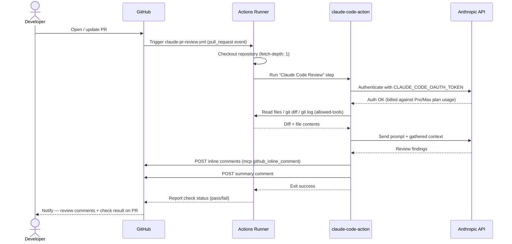

# Claude PR Review — sequence diagram

How the automated review actually runs once set up (OAuth-token auth path).

## Why this is simpler than WIF

The OAuth token is the *only* new credential in the whole chain — checkout,
diff reading, and comment posting all run under the runner's own GitHub-side
permissions. Anthropic never needs to know anything about the repo's
structure, organization, or workspace layout, which is exactly the surface
area that WIF's federation rule (issuer, subject pattern, claim conditions,
workspace targeting) has to get right instead.
